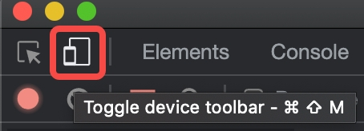

# ByteVod-H5-Demo

- [Vod demo](#ByteVod-H5-Demo)
  - [Introduction](#introduction)
  - [QuickStart](#QuickStart)
  - [Documentation](#Documentation)
  - [FolderStructure](#FolderStructure)
## Introduction

本项目为字节跳动-视频云-视频播放demo项目，采用 Nodejs 和 ReactJs 搭建，提供了如下功能的演示:
1. 火山引擎openApi调用
2. 短、中、长视频的不同场景播放功能
3. 西瓜播放器的基础使用方法
用户可以下载本项目源码，快速搭建自己的小视频播放项目。

注意：在浏览器通过yarn dev启动本项目之后，需要F12打开开发工具，并点击左上角的移动设备按钮，如下图所示



## QuickStart

```bash
# Clone the repository
git clone git@github.com:volcengine/vod-demo-h5.git

# Install dependencies
yarn (or npm install)

Follow Documentation and get AK / SK
# Start development server
yarn dev (or npm run dev)
```

## Documentation
1. 在火山引擎注册账号，获取AK/SK（教程） https://www.volcengine.com/docs/4/4374
2. 替换 src/server/config.js 中的 AK/SK
3. 通过yarn dev同时启动项目的client和server

## FolderStructure
所有功能代码都在`src`文件夹下，其中js、css等页面功能代码在`client`中，请求api的node代码在`server`中


